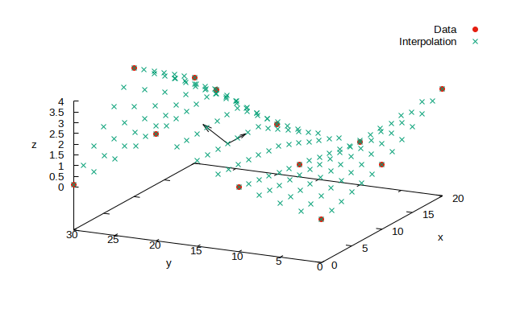

# C++ interface for 2D bilinear interpolation with GNU Scientific Library (GSL)

Usage:

Initialize data interface:

    const std::string path = "./input/in.csv";
    const std::string column_name_x = "x";
    const std::string column_name_y = "y";
    const std::string column_name_z = "z";

    GridDataInterface grid_data(path, column_name_x, column_name_y, column_name_z);

Initialize interpolation interface:

    Interpolation2D myinterp;
    myinterp.setData(grid_data);

Get the interpolated z value for (x,y) coordinates: 

    double x,y,z;
    x=0.3;
    y=11.7;
    z = myinterp.getInterpolation(x, y);

--------------------

## Examples

`interpolation2d_example.cpp` (with `interpolation2d_example.h`) contains examples for 2D bilinear interpolation. 

### Example usage of my C++ interface

    ./interpolation2dcpp.run --example=1 > ./output/out1.csv

This runs interpolation using my C++ interface for 2D bilinear interpolation with GSL on a set of points between the data stored in a file. 

The program reads data from the file `./input/in.csv`. The file contains a 3x4 grid ("x" and "y" columns) with the "z" column of values. 

The output are x, y, z coordinates of the interpolated points.

Fig. 1: Output from the Example 1, plotted with gnuplot:

    set datafile separator ","; set xlabel "x"; set ylabel "y"; set zlabel "z"; splot "./input/in.csv" u 1:2:3 lt 7, "./output/out1.csv" u 1:2:3

### Original C example for comparison

Usage:

    ./interpolation2dcpp.run --example=2 --N=5 > ./output/out2.csv

This runs the original C example from GNU Scientific Library documentation (slightly modified by me), https://www.gnu.org/software/gsl/doc/html/interp.html#c.gsl_interp2d_eval

List of my modifications:

1. I updated the code for C++ compiler by adding `(double *)` in

        double *data_grid_z = (double *)malloc(data_grid_x_size * data_grid_y_size * sizeof(double));
        
2. The grid point values are 0. and 10. to make it clear that the `int` numbers 0 and 1 in `gsl_spline2d_set()` are grid point numbering and not grid point coordinates.

3. I rescaled the interpolation point positions according to the grid limits (which are here `data_grid_x[1]` and `data_grid_y[1]`).

<<<<<<< HEAD
4. I allowed to change the number of data points to interpolate. Here, `--N=5` is the parameter at program launch, so the total number of interpolated points is N*N=25.
=======
4. I changed the number of data points to interpolate. Here, `N=5`, so the total number of interpolated points is N*N=25.
>>>>>>> fc6d84daf677bda612eba59a0f720be0f89c8a8f

The output are x, y, z coordinates of the interpolated points.

---------

